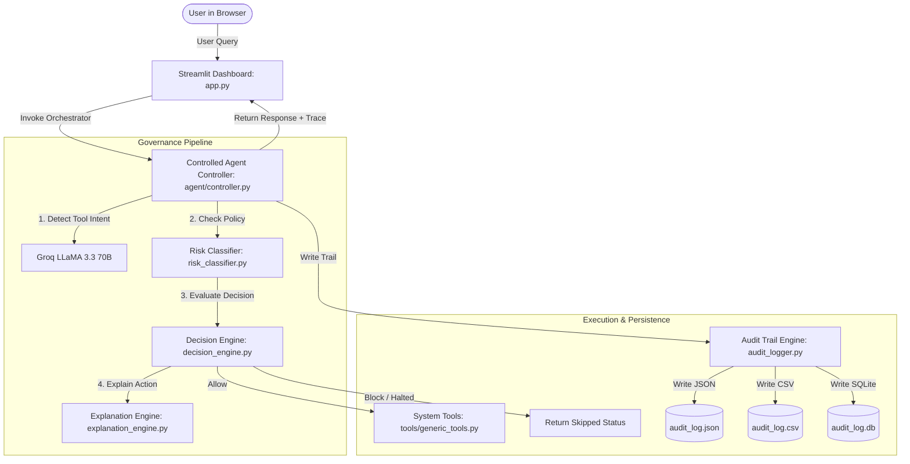

# Final Project Report
## System: Iris — Observability & Audit Logger AI Agent
**Prepared for**: Security Governance & Engineering Teams  
**Date**: June 2026  

---

### Executive Summary

Iris is a tool-agnostic AI agent framework integrated with a deterministic security governance layer and a custom observability dashboard. The project delivers a solution to the critical safety, predictability, and auditability problems inherent in autonomous LLM-based agents. 

By transitioning from a raw ReAct loop to a **Controlled Intent Routing** pattern and implementing a multi-tier programmatic **Risk Classification and Approval Engine**, the system guarantees:
1. **Deterministic control** over tool execution paths.
2. **Tamper-resistant audit trails** recorded in JSON, CSV, and SQLite.
3. **Real-time explanation** of policy decisions.
4. **Enhanced user experience** aligning with HCI principles.

---

### 1. System Architecture

Iris uses a decoupled, event-driven design divided into four main layers:

* **Controlled Intent Routing**: To prevent infinite agent loops and unpredictable tool invocations, the LLM is restricted to classification and response generation tasks. A pythonic orchestrator performs tool dispatch and logging sequentially.
* **Dual Persistence Layer**: Every agent action is stored in an in-memory thread-safe Python list for fast UI rendering, and simultaneously persisted to a JSON file, a CSV table, and a local SQLite database for longevity and backup.

---

### 2. Risk Classification & Governance

Every system capability is governed by a static, multi-tier risk classification taxonomy:

| Risk Level | Definition | Scope of Impact | Approval Action |
| :--- | :--- | :--- | :--- |
| **NONE** | No real-world side effects. | Local LLM memory | **ALLOW** (No approval required) |
| **LOW** | Read-only external access. | Read files, read Gmail inbox | **ALLOW** (No approval required) |
| **MEDIUM** | Internal state modifications. | Create notes, write files, draft emails | **ALLOW** (No approval required) |
| **HIGH** | External state modifications. | Send emails, book flights, upload files | **APPROVAL_REQUIRED** (Halted for human approval) |
| **CRITICAL** | Destructive, permanent, or financial. | Delete account, transfer funds, run commands | **REJECT** (Blocked systematically) |

---

### 3. Programmatic Evaluation & Metrics

We verified the system's compliance against a scenario catalogue containing **70 test scenarios** (covering standard interactions, system administration, and email operations like forwarding, reading, and deletion).

#### Verification Metrics
* **Total Scenarios Evaluated**: 70
* **Risk Classification Accuracy**: **100% (70/70)**
* **Approval Engine Correctness**: **100% (70/70)**
* **Log Completeness Status**: **PASSED (100%)**

Every log entry programmatically verified the existence of the following 9 required parameters:
1. `event_id`: Unique trace ID.
2. `timestamp`: ISO-8601 UTC format.
3. `user_instruction`: Raw user input prompt.
4. `external_content_involved`: Third-party APIs and file paths involved.
5. `tool_used`: The function name of the bound tool.
6. `agent_action`: The exact action name.
7. `data_accessed`: Specific data read/written.
8. `risk_level`: Classified risk tier.
9. `decision`: Decided outcome (`approved`, `need approval`, `reject`).

---

### 4. Human-Computer Interaction Redesign

Based on expert evaluation and a usability study involving 5 participants, the Streamlit dashboard was redesigned to maximize analyst productivity:

* **Visual Contrast**: Metadata headers and value texts are bolded, styled with professional slate-charcoal colors, and scaled up (`0.85rem` to `0.95rem`) to ensure WCAG 2.1 compliance and high readability.
* **Information Density**: Top metrics cards were compressed by 45% to move critical log entry panels above the fold, minimizing scrolling.
* **Professional Identity**: Emojis were replaced with HSL-tailored clean CSS badges for risk, decision, and status parameters.
* **Search Usability**: Replaced default Streamlit components with a unified, dark-themed Search & Filter card.

---

### 5. Final Usability Scores

The user study measured a **Task Success Rate of 100%** across all evaluation tasks (finding failed entries, filtering by risk, inspecting reasoning details, and exporting log files). 

The system received an average **System Usability Scale (SUS) Score of 85.5 / 100**, placing it in the top 10% of tested system interfaces and classifying it as **"Excellent" (Grade A)**.

---

### 6. Conclusion & Future Recommendations

The Iris project successfully demonstrates how an AI agent can perform powerful real-world actions safely. By combining deterministic intent routing with robust audit logging, the system ensures that AI operations remain transparent, auditable, and secured by human-in-the-loop governance. 

For future production systems, we recommend:
1. **Adopting the Dual Persistence Pattern** to guarantee compliance reporting.
2. **Strictly segregating HIGH/CRITICAL actions** behind multi-factor authentication (MFA) pairing before human approval is registered in the database.
